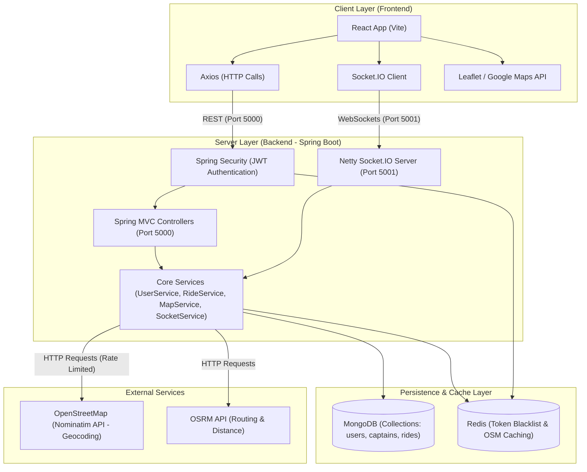
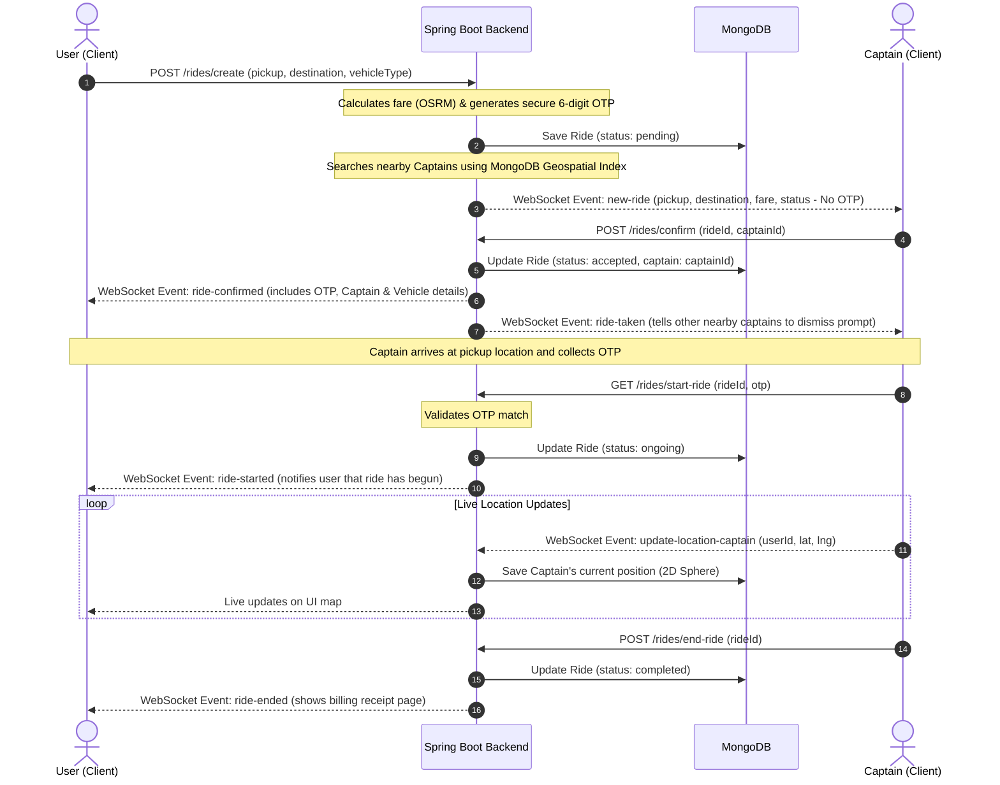
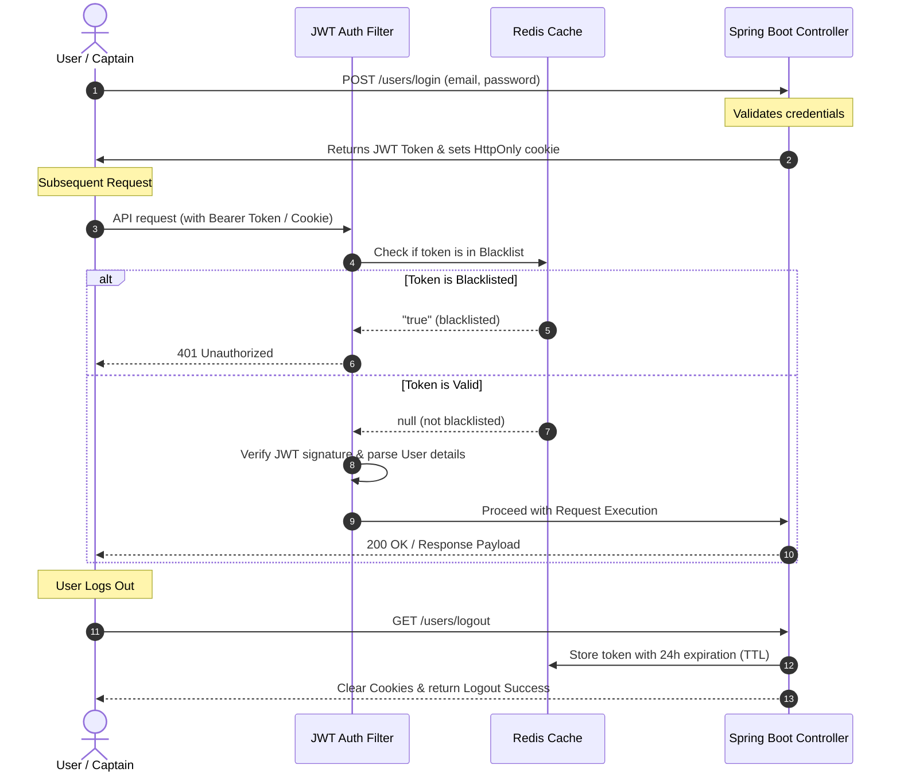

# 🚖 Uber Clone - Real-time Ride Booking System

A premium, production-grade Uber Clone built with a modern hybrid stack: **Spring Boot (Java 17)** for a robust back-end, **React (Vite)** for a dynamic, smooth front-end, **MongoDB** for geolocation/geospatial storage, and **Redis** for token blacklisting and high-performance caching.

This application provides real-time ride requests, automatic driver (Captain) matchmaking within a geospatial radius, live GPS location tracking, secure OTP (One-Time Password) ride initiation, and a comprehensive ride history dashboard.

---

## 🏗️ System Architecture

The project utilizes a hybrid routing and mapping engine: calculations like distance, travel duration, autocomplete suggestions, and coordinate mapping are calculated on the back-end using **OpenStreetMap (Nominatim)** and **OSRM (Open Source Routing Machine)**. The front-end leverages **Leaflet** and **Google Maps APIs** for rendering interactive maps and plotting routing paths.



---

## 🔄 Core Dataflow Diagrams

### 1. Ride Booking & Matching Lifecycle
This diagram details the sequence of REST endpoints and WebSocket messages exchanged from the moment a User requests a ride until it is completed by the Captain.



### 2. Session Authentication & Token Blacklisting
This flow demonstrates how user sessions are secured using JWT (JSON Web Tokens) and how logging out instantly invalidates tokens using Redis.



---

## ⚡ WebSocket Event Specification (Port `5001`)

WebSocket communication is handled via **Netty-Socket.IO** to support asynchronous, real-time client-server updates.

| Event Name | Sender | Receiver | Description | Payload Format |
| :--- | :--- | :--- | :--- | :--- |
| `join` | Client (Any) | Server | Connects a socket session ID and associates it with the MongoDB User/Captain document. | `{ "userId": "string", "userType": "user / captain" }` |
| `update-location-captain` | Captain | Server | Pushes the driver's real-time GPS coordinates. Updates the driver's MongoDB Geospatial index. | `{ "userId": "string", "location": { "lat": double, "lng": double } }` |
| `new-ride` | Server | Captains | Broadcasted to all active captains within a 10km radius of the pickup location. | `Ride` object (excludes security OTP) |
| `ride-confirmed` | Server | User | Sent to the passenger when a captain accepts the ride. Includes driver profile, vehicle details, and the verification OTP. | `Ride` object (includes `otp`, `captain` details) |
| `ride-taken` | Server | Captains | Sent to nearby captains to dismiss the current ride request popup because another driver accepted it. | `{ "rideId": "string" }` |
| `ride-started` | Server | User | Sent when the driver inputs the correct OTP. Notifies the user that the trip has active tracking. | `Ride` object (status: `ongoing`) |
| `ride-ended` | Server | User | Sent when the driver marks the ride as completed at the destination. | `Ride` object (status: `completed`) |

---

## 📂 Project Structure

```
Uber-Clone-master/
├── Backend/                    # Spring Boot Project
│   ├── src/main/java/          # Core Java source files
│   │   └── com/uberclone/backend/
│   │       ├── config/         # Security configs, Redis config, SocketIO config
│   │       ├── controller/     # REST Endpoints (User, Captain, Ride, Map)
│   │       ├── model/          # MongoDB Documents (User, Captain, Ride)
│   │       ├── repository/     # Data Access Objects (Mongo queries & Geospatial index)
│   │       ├── security/       # JWT filters & Token Provider
│   │       ├── service/        # Core business operations (Map calculations, Ride lifecycle)
│   │       └── socket/         # Netty-Socket.IO listeners & emitters
│   ├── src/main/resources/     # application.yml and static assets
│   ├── Dockerfile              # Docker build configuration for Backend
│   └── pom.xml                 # Maven dependencies
│
├── Frontend/                   # React Vite Project
│   ├── src/
│   │   ├── components/         # Modular UI panels (RidePopup, VehiclePanel, GPS tracking)
│   │   ├── context/            # React Global States (User, Captain, Socket.IO context)
│   │   ├── pages/              # Routing pages (Home, Sign-in, Sign-up, Live Tracking)
│   │   ├── index.css           # Styling system configuration
│   │   └── main.jsx            # React App entry point
│   ├── Dockerfile              # Frontend container configuration
│   ├── tailwind.config.js      # Styling utilities layout
│   └── package.json            # NPM dependencies
│
└── docker-compose.yml          # Master compose file to spin up DBs and Apps
```

---

## 🛠️ Local Environment & Deployment Guide

### Prerequisites
- Docker & Docker Compose installed.
- **Or** local installations of:
  - Java 17 Development Kit (JDK)
  - Node.js (v18+) & NPM
  - MongoDB (running locally on port `27017`)
  - Redis (running locally on port `6379`)

---

### Option A: Running with Docker Compose (Easiest)
Spin up the entire application stack—including MongoDB, Redis, the Spring Boot API service, and the React Nginx front-end web server—with a single command:

1. **Set your Google Maps API Key** (used for Frontend map rendering):
   ```bash
   # Windows (PowerShell)
   $env:GOOGLE_MAPS_API="AIzaSyYourGoogleMapsAPIKeyHere"
   
   # Linux/macOS
   export GOOGLE_MAPS_API="AIzaSyYourGoogleMapsAPIKeyHere"
   ```

2. **Boot up the containers**:
   ```bash
   docker-compose up --build
   ```

3. **Access the application**:
   - **Frontend App**: [http://localhost:5174](http://localhost:5174)
   - **Backend API**: [http://localhost:5000](http://localhost:5000)
   - **Websocket Port**: `5001`

---

### Option B: Running Manually for Local Development

#### 1. Setup Environment Configuration
Create a `.env` file in the root directory:
```env
MONGODB_URI=mongodb://localhost:27017/uber-clone
REDIS_HOST=localhost
REDIS_PORT=6379
JWT_SECRET=YourSuperSecretKeyAtLeast256BitsLongForJWTAuthentication
GOOGLE_MAPS_API=AIzaSyYourGoogleMapsAPIKeyHere
```

#### 2. Start Services (Backend)
Navigate to the `Backend/` directory:
```bash
cd Backend
# Build and run using Maven
mvn spring-boot:run
```
*The Spring Boot server will run on [http://localhost:5000](http://localhost:5000) and the WebSockets socket server on `5001`.*

#### 3. Start Services (Frontend)
Navigate to the `Frontend/` directory:
```bash
cd Frontend
# Install dependencies
npm install

# Run the development server
npm run dev
```
*The React application will launch on [http://localhost:5173](http://localhost:5173) or the next available port.*

---

## 🛡️ License
Distributed under the MIT License. See `LICENSE` for more details.
